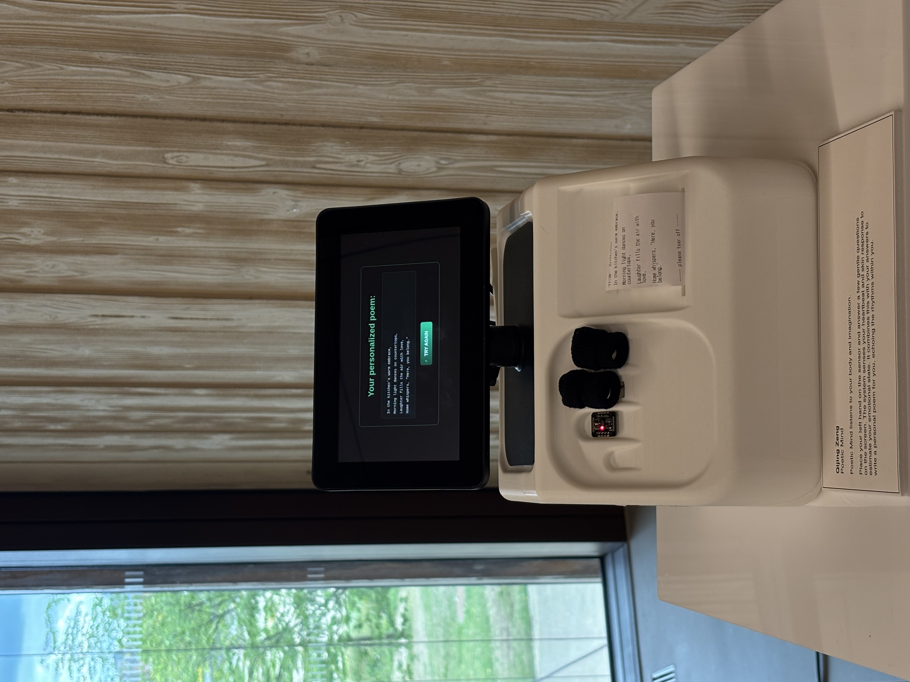
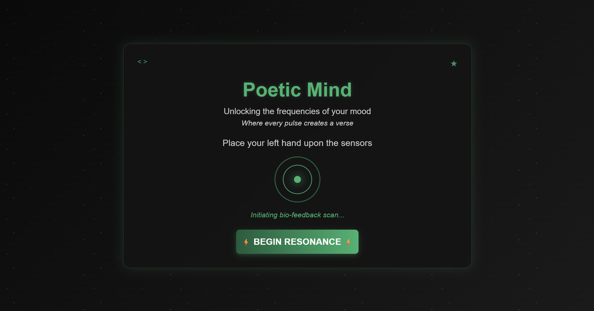
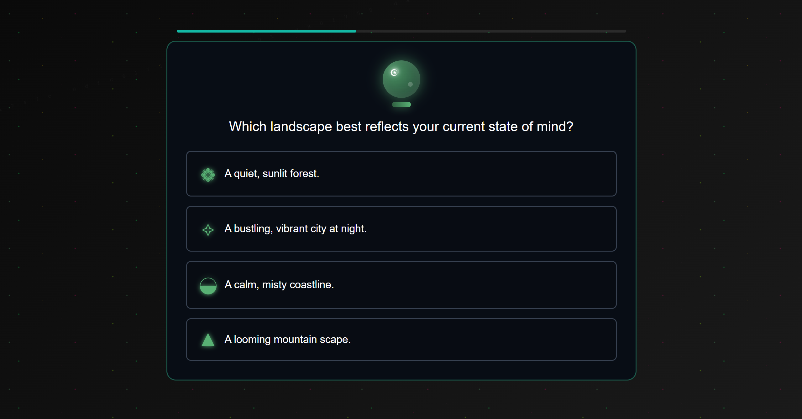
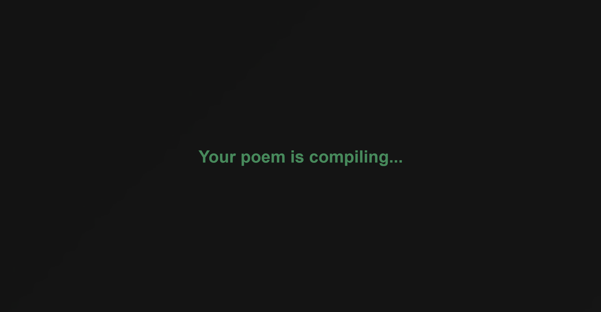

# PoeticMind
A Personalised Poetry Generation System Integrating Physiological Signals, Affective Self-Report Measures and Large Language Model.



## How to use?
Place your left hand on the sensor and answer a few gentle questions on the screen. The system senses your heartbeat and skin response to estimate your emotional state. It combines this with your answers to write a personal poem for you, echoing the rhythms within you.


## UI pages
home page:




countdown page:


question page:




waiting page:




poetry display page:


## Hardware Components
Components list:


Wiring method:


Schematic diagram:


## Installation 💻🚀
Step 1: Upload the “Arduino33” code to the Arduino Nano 33 IoT board. At this time, the Arduino board is connected to the MAX30102 sensor, GSR sensor, and printer.
Step 2: Connecting the Arduino part to the Raspberry Pi via a serial port, then turning on the power, configuring the Wi-Fi network for the Raspberry Pi.
Step 3: Create a new folder named poetry_app on the Raspberry Pi and place the raspberryPi.py file inside it. Within this folder, create another folder named “templates” and upload the “index.html” code to this folder. Note: The path to “index.html” within the Raspberry Pi folder is: poetry_app/templates/index.html
Step 4: Set up a virtual environment and install dependencies
Since the Raspberry Pi system prevents system dependencies from being broken, installing Flask directly may be prohibited. This can be resolved by creating a virtual environment in Raspberry Pi. Enter the following command in Raspberry Pi to set up a virtual environment:
```
cd poetry_app
```
Create a virtual environment (only once):
```
python3 -m venv venv
```
Activate the virtual environment (In future, before you run the “raspberryPi” file, you'll need to open the folder and activate the virtual environment)
```
source venv/bin/activate
```
Install dependencies
```
source venv/bin/activate
```
```
pip install pyserial openai
```
Step 5: running 'raspberryPi.pi'
```
python raspberryPi.py
```
Step 6: visiting http://localhost:5000 directly in a raspberry browser
